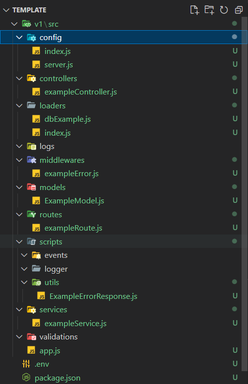

# CREATE NODEJS TEMPLATE

Go to the directory where you want to create the template

# Open Terminal

node template.js

**note: make sure nodejs is installed on your computer**

# install required setups

npm install

# you are ready now

npm start

# Folder Structure View

**GOOD LUCK!**

